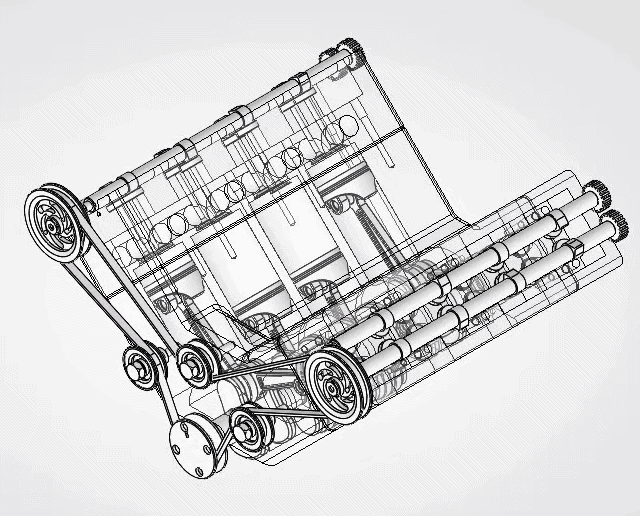
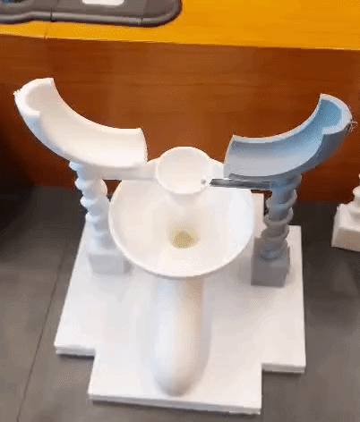

# Engineering CAD & Hardware Portfolio

**Hong Yan Jun**  
M.Sc. Mechatronics, Robotics & Biomechanical Engineering — Technical University of Munich (TUM)  
B.Sc. Mechanical Engineering — University of Duisburg-Essen  
Certified SOLIDWORKS Professional (CSWP) — Mechanical Design  
Email: ryanhong9@gmail.com | Munich, Germany

---

## Portfolio Document

> **[View Complete CAD Portfolio (PDF)](./Ryan's%20CAD%20Portfolio.pdf)**

---

## Featured Projects

### 1. Acoustic Localization Sentry

* **Overview:** Multi-axis pan-tilt platform housing an STM32 MCU, dual microphones, and servo linkages for real-time acoustic targeting.
* **FEA & Optimization:** Redesigned base plate via linear static FEA iterations, reducing mass by **41.5%** and print time by **10 minutes** while maintaining factor of safety $n = 28$.
* **Deliverables:** Fully dimensioned 2D production drawings with GD&T datum reference frames and integrated cable channels.

### 2. V8 Internal Combustion Engine Assembly

* **Overview:** 89-part naturally aspirated 90-degree V8 assembly (2.46L) featuring valvetrain, cross-plane crankshaft, and timing drive kinematics.
* **Design & GD&T:** Exploded assembly BOM structuring and manufacturing drawings for cylinder block, crankshaft, pistons, and rods with strict runout, parallelism, and position tolerances.

### 3. Modular Kinematic Mechanism (Marble Run)

* **Overview:** Passive, self-resetting tipping bucket mechanism governed by dynamic torque equilibrium:
  $$\sum \tau_{\text{pivot}} = (m_{\text{marble}} \cdot g \cdot x_{\text{marble}}) - (m_{\text{bucket}} \cdot g \cdot x_{\text{bucket}})$$
* **Kinematics:** Tuned 14.00 mm pivot offset and 9.83° incline ramp to trigger tipping under load and ensure immediate self-righting after marble release.
* **DfAM:** Incorporated 45° overhang chamfers, teardrop self-supporting apertures, and optimal build orientations, cutting print time by **51 minutes** without internal support structures.

---

## Core Competencies

* **CAD & Standards:** SOLIDWORKS (CSWP), CATIA V5, 3DEXPERIENCE, GD&T, BOM Architecture.
* **Kinematics & FEA:** Linear Static FEA, Multi-Body Kinematics, Actuator Sizing.
* **Validation & Tools:** STM32 HAL, dSPACE ControlDesk, Vector CANape, Python, MATLAB/Simulink, C/C++.
